# Отчёт по лабораторной работе №5

Министерство науки и высшего образования Российской Федерации
Федеральное государственное автономное образовательное учреждение высшего образования
«НАЦИОНАЛЬНЫЙ ИССЛЕДОВАТЕЛЬСКИЙ УНИВЕРСИТЕТ ИТМО»

---

## Отчёт по лабораторной работе №5

### «Продвинутая работа с системой контроля версий Git»

по дисциплине «Компьютерные сети»

|                |     |
| -------------- | --- |
| Автор:         |     |
| Факультет:     |     |
| Группа:        |     |
| Преподаватель: |     |

Санкт-Петербург 2026

---

## 1. Цель работы

Освоить продвинутые приёмы работы с системой контроля версий Git: работу с
ветками, синхронизацию с удалённым репозиторием, моделирование и разрешение
конфликтов слияния, автоматизацию проверок с помощью хуков Git, а также
организацию процесса разработки по модели Git Flow.

## 2. Задание

1. Создать репозиторий на GitHub, склонировать его, выполнить первый коммит и
   отправку изменений, поработать с веткой и слиянием.
2. Создать ветку для новой функциональности и отправить её на GitHub.
3. Внести изменения в основной ветке и синхронизировать их с удалённым
   репозиторием.
4. Смоделировать конфликт слияния и разрешить его.
5. Настроить автоматическую проверку формата файлов при коммите средствами
   Git Hooks.
6. Применить модель Git Flow для управления фичами, релизами и исправлениями.

Работа выполнялась в репозитории `https://github.com/RasamVaziri/git-practice`
в терминале PowerShell в среде Visual Studio Code на ОС Windows.

## 3. Ход работы

### 3.1. Создание репозитория и базовая работа с Git

На GitHub создан новый репозиторий `git-practice`.

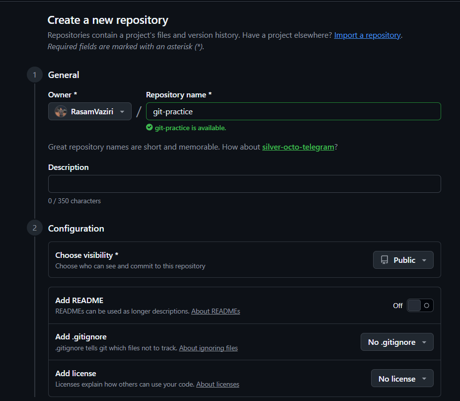

Рисунок 1 — Форма создания репозитория `git-practice` без файлов README и .gitignore.

Репозиторий склонирован на локальную машину. В него добавлен файл `example.txt`,
выполнен первый коммит и отправка в удалённый репозиторий:

```powershell
git add example.txt
git commit -m "Изменения в example.txt"
git push -u origin main
```

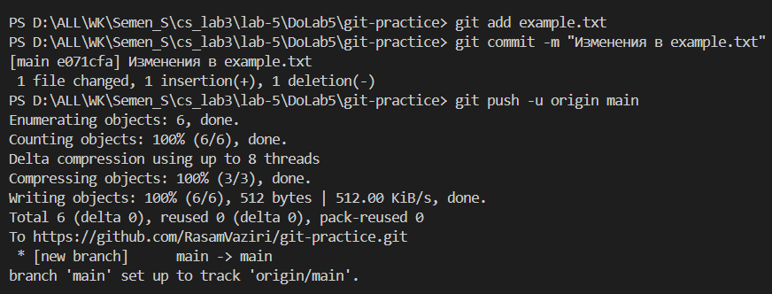

Рисунок 2 — Первый коммит файла `example.txt` и его отправка в ветку `main`.

Создана и активирована новая ветка `feature-branch`:

```powershell
git branch feature-branch
git checkout feature-branch
```

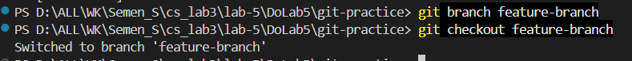

Рисунок 3 — Создание ветки `feature-branch` и переключение на неё.

В ветке `feature-branch` файл `example.txt` дополнен, изменения закоммичены и
отправлены на GitHub:

```powershell
git add example.txt
git commit -m "Change file example.txt"
git push --set-upstream origin feature-branch
```

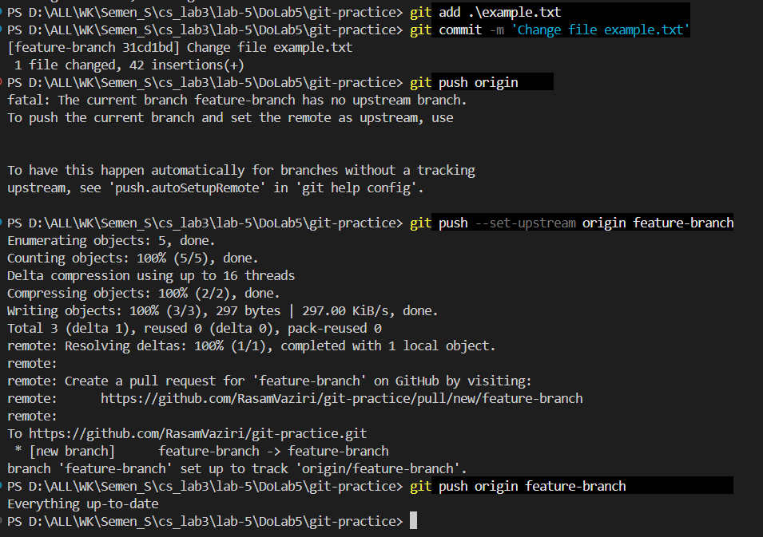

Рисунок 4 — Коммит изменений в `feature-branch` и отправка ветки в удалённый репозиторий.

Изменения из `feature-branch` слиты обратно в `main` и отправлены на GitHub:

```powershell
git checkout main
git merge feature-branch
git push origin main
```

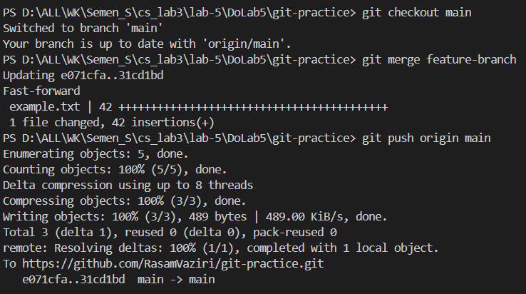

Рисунок 5 — Слияние ветки `feature-branch` в `main` в режиме Fast-forward и отправка результата.

### 3.2. Работа с ветками

Для разработки новой функциональности создана ветка `feature-login`:

```powershell
git checkout -b feature-login
```

В ней подготовлен файл `README.md` с базовой структурой книги и добавлена
Глава 3.

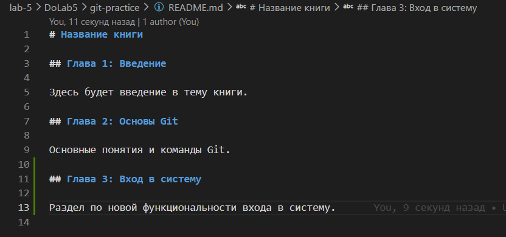

Рисунок 6 — Содержимое `README.md` с главами 1, 2 и добавленной главой 3.

Изменения закоммичены и ветка отправлена на GitHub:

```powershell
git add README.md
git commit -m "Add chapter 3: Login"
git push origin feature-login
```

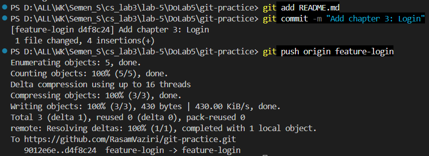

Рисунок 7 — Коммит главы 3 и отправка ветки `feature-login` в удалённый репозиторий.

### 3.3. Работа с удалённым репозиторием

Файл книги создавался в ветке `feature-login`, поэтому он перенесён в `main`
слиянием, после чего работа с книгой продолжена в основной ветке:

```powershell
git checkout main
git merge feature-login
git push origin main
```

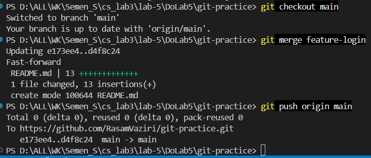

Рисунок 8 — Слияние `feature-login` в `main` в режиме Fast-forward, в `main` появился файл `README.md`.

В основной ветке изменены название книги, текст введения и Глава 2, изменения
отправлены на GitHub:

```powershell
git add README.md
git commit -m "Change book title and update Chapter 2"
git push origin main
```

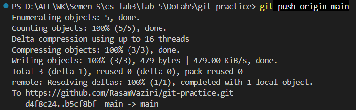

Рисунок 9 — Отправка в `main` изменённого названия книги и Главы 2.

### 3.4. Моделирование конфликта

Чтобы при слиянии возник конфликт, одна и та же Глава 2 изменена в ветке
`feature-login` иначе, чем в `main`.

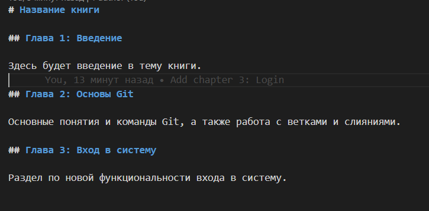

Рисунок 10 — Версия Главы 2 в ветке `feature-login`, отличная от версии в `main`.

Изменения закоммичены и отправлены на GitHub:

```powershell
git checkout feature-login
git add README.md
git commit -m "Update Chapter 2 in feature-login"
git push origin feature-login
```

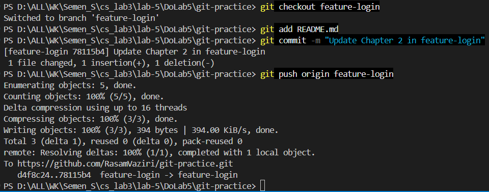

Рисунок 11 — Коммит и отправка изменённой Главы 2 в ветке `feature-login`.

### 3.5. Разрешение конфликта

В основной ветке выполнена попытка слияния `feature-login`, что привело к
конфликту в файле `README.md`:

```powershell
git checkout main
git merge feature-login
```

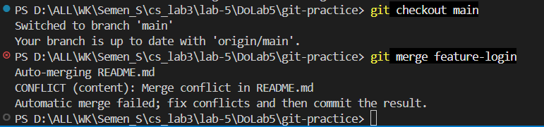

Рисунок 12 — Сообщение о конфликте: CONFLICT (content): Merge conflict in README.md.

В файле появились метки конфликта, разделяющие версию из `main` и версию из
`feature-login`.

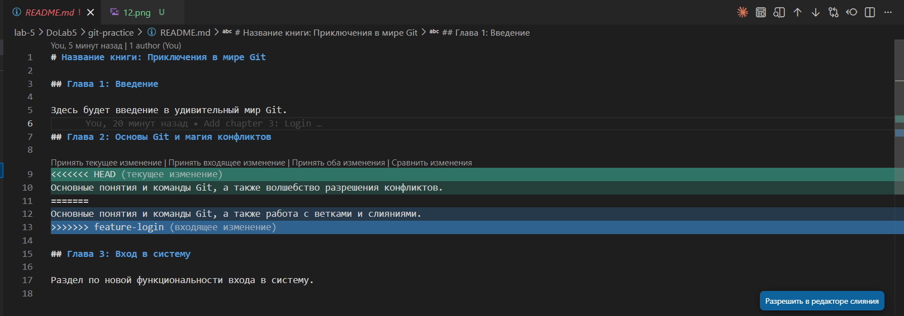

Рисунок 13 — Метки конфликта `<<<<<<< HEAD`, `=======`, `>>>>>>> feature-login` в районе Главы 2.

Конфликт разрешён вручную, метки удалены, оставлен нужный вариант Главы 2.
Результат закоммичен и отправлен на GitHub:

```powershell
git add README.md
git commit -m "Resolve conflict in Chapter 2"
git push origin main
```

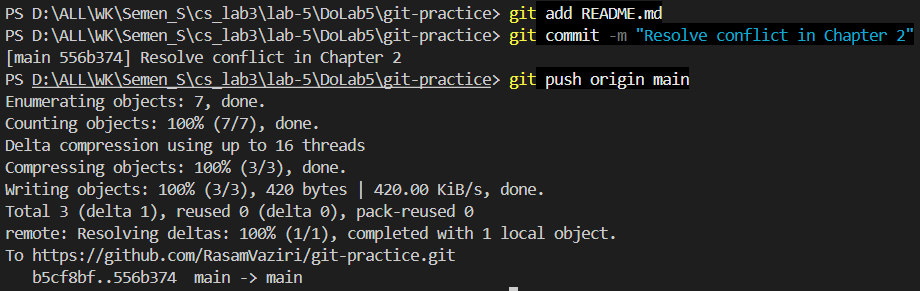

Рисунок 14 — Создание коммита слияния с разрешённым конфликтом и отправка в `main`.

### 3.6. Автоматизация проверки формата файлов (Git Hooks)

Для автоматической проверки файлов при коммите подготовлен скрипт
`check_format.sh`. Скрипт перебирает проиндексированные файлы и отклоняет коммит,
если среди файлов с расширением `.txt` есть пустой.

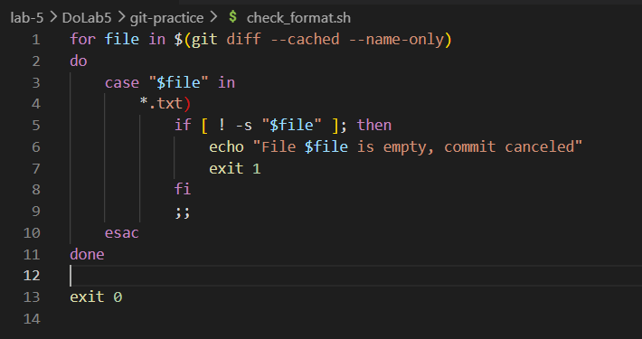

Рисунок 15 — Содержимое скрипта `check_format.sh`.

Скрипт добавлен в репозиторий и установлен как хук `pre-commit`. На ОС Windows
команда `chmod +x` не требуется, так как Git for Windows запускает хук
встроенным интерпретатором:

```powershell
git add check_format.sh
git commit -m "Add check_format.sh pre-commit script"
Copy-Item check_format.sh .git\hooks\pre-commit
```

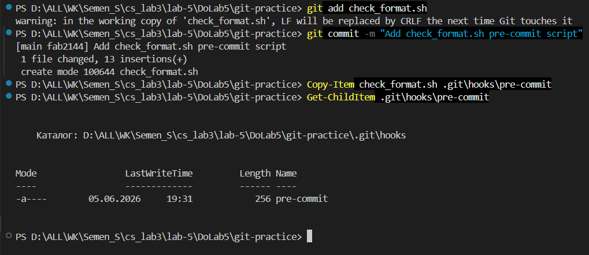

Рисунок 16 — Коммит скрипта и копирование его в `.git/hooks/pre-commit`.

Работа хука проверена. Создан пустой файл `notes.txt`. При попытке его
закоммитить коммит отклоняется:

```powershell
git add notes.txt
git commit -m "Add notes.txt"
```

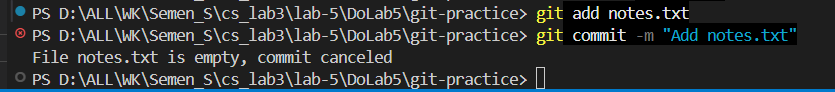

Рисунок 17 — Хук отклонил коммит с сообщением «File notes.txt is empty, commit canceled».

После того как в файл `notes.txt` записан текст, коммит проходит успешно:

```powershell
git add notes.txt
git commit -m "Add notes.txt with content"
```

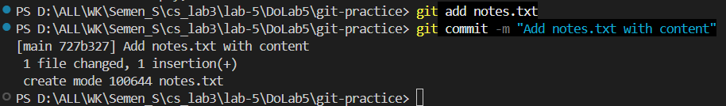

Рисунок 18 — Непустой файл `notes.txt` проходит проверку, коммит создан.

### 3.7. Использование Git Flow

В состав Git for Windows входит расширение git-flow, поэтому отдельная установка
не требуется. Проверена версия расширения:

```powershell
git flow version
```


Рисунок 19 — Установленная версия git-flow 1.12.3 (AVH Edition).

Так как репозиторий использует основную ветку `main`, перед инициализацией
вручную создана ветка `develop`, после чего выполнена инициализация Git Flow с
параметрами по умолчанию:

```powershell
git branch develop
git flow init
```

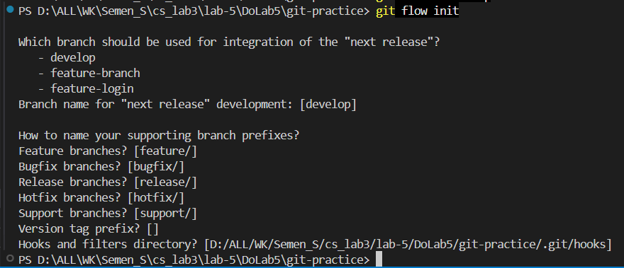

Рисунок 20 — Инициализация Git Flow: ветка интеграции `develop`, стандартные префиксы веток.

Создана фича `task-management`, в неё добавлен файл `task_manager.py` и выполнен
коммит:

```powershell
git flow feature start task-management
git add task_manager.py
git commit -m "Add task management functionality"
```

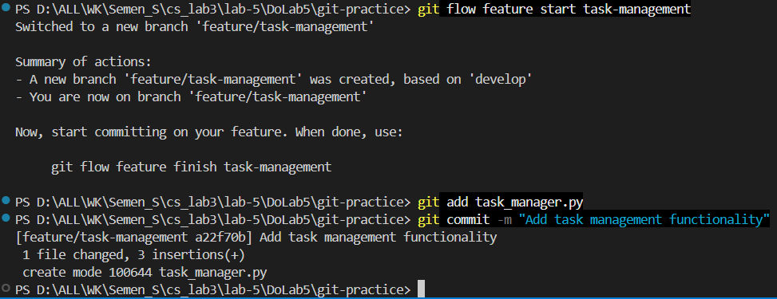

Рисунок 21 — Создание ветки `feature/task-management` на основе `develop` и коммит функциональности.

Фича завершена и слита в ветку `develop`:

```powershell
git flow feature finish task-management
```

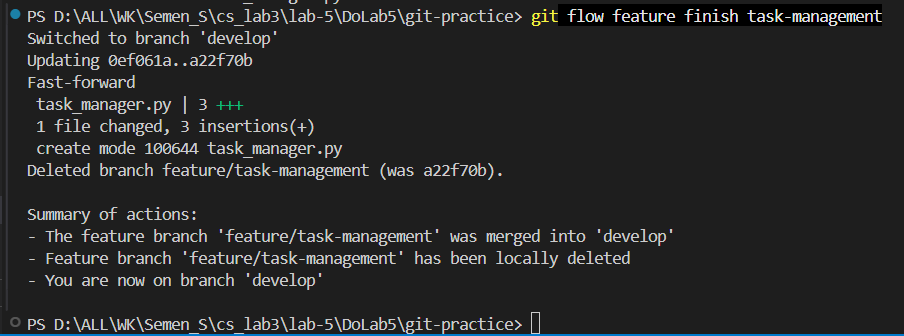

Рисунок 22 — Слияние фичи `task-management` в `develop` и удаление ветки фичи.

Начат релиз `v1.0.0`. Создан файл `version.txt`, в него записан номер версии,
выполнен коммит и завершение релиза. При завершении релиз слит в `main` и
`develop`, создан тег `v1.0.0`:

```powershell
git checkout develop
git flow release start v1.0.0
git add version.txt
git commit -m "Bump version to v1.0.0"
git flow release finish -m "Release v1.0.0" v1.0.0
```

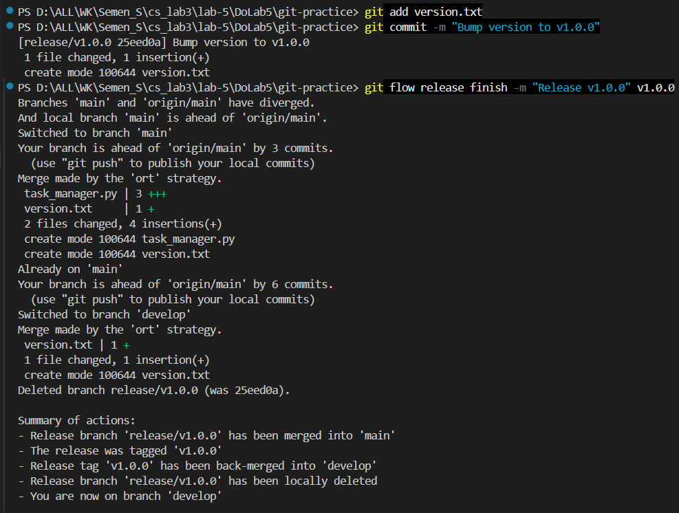

Рисунок 23 — Завершение релиза `v1.0.0`: слияние в `main` и `develop`, установка тега `v1.0.0`.

Для исправления критической ошибки создан хотфикс `hotfix-1.0.1`, в него добавлен
файл с исправлением, выполнен коммит и завершение хотфикса. Хотфикс слит в `main`
и `develop`, создан тег `hotfix-1.0.1`:

```powershell
git flow hotfix start hotfix-1.0.1
git add file_with_error.py
git commit -m "Fix critical bug"
git flow hotfix finish -m "Hotfix 1.0.1" hotfix-1.0.1
```

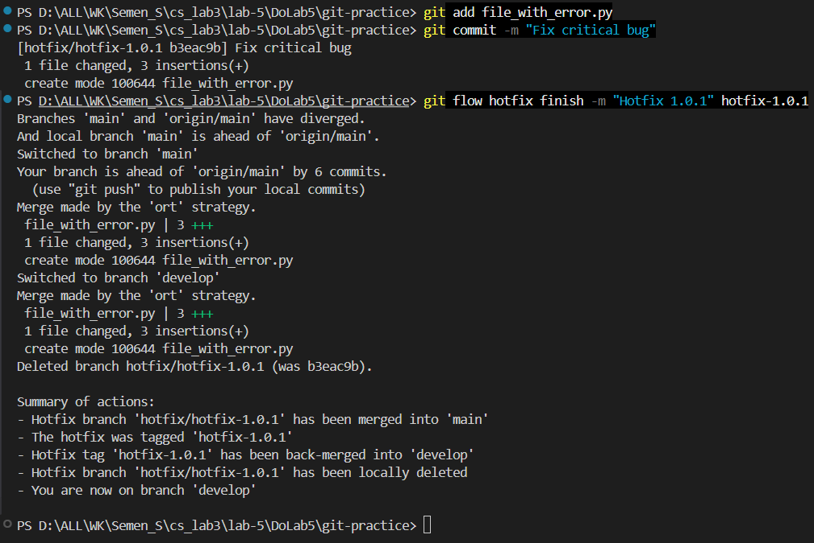

Рисунок 24 — Завершение хотфикса `hotfix-1.0.1`: слияние в `main` и `develop`, установка тега `hotfix-1.0.1`.

Итоговые изменения и теги отправлены в удалённый репозиторий:

```powershell
git checkout main
git push origin main
git push origin develop
git push origin --tags
```

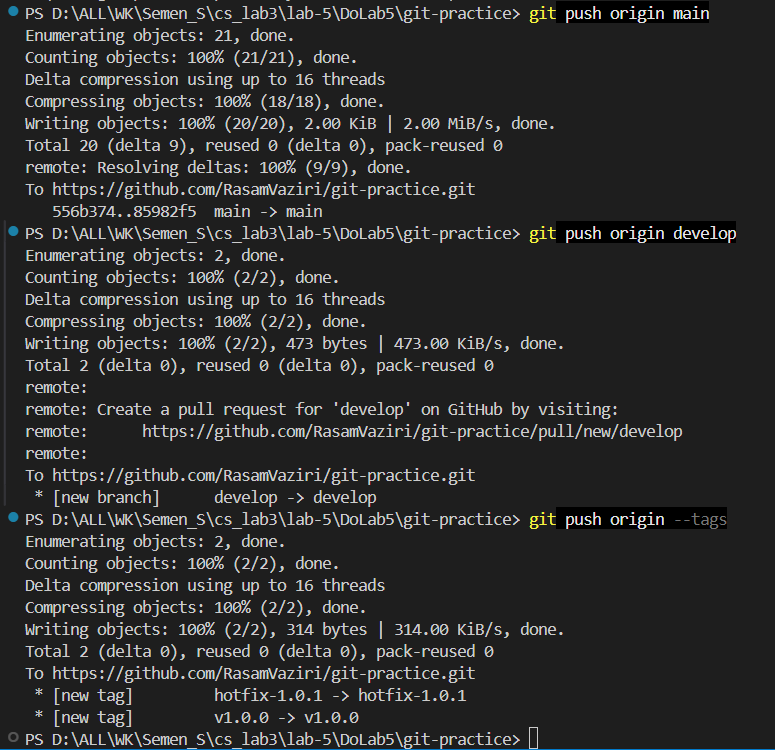

Рисунок 25 — Отправка веток `main`, `develop` и тегов `v1.0.0`, `hotfix-1.0.1` на GitHub.

## 4. Вывод

В ходе лабораторной работы освоены продвинутые приёмы работы с системой контроля
версий Git. Выполнены создание репозитория, работа с ветвлением и слиянием,
синхронизация с удалённым репозиторием на GitHub. Смоделирован и разрешён
конфликт слияния, возникающий при изменении одного и того же фрагмента файла в
разных ветках. Настроен хук `pre-commit`, автоматически проверяющий формат
файлов при коммите и отклоняющий коммит пустых текстовых файлов. Освоена модель
Git Flow: реализованы полные циклы работы с фичей, релизом и хотфиксом, включая
автоматические слияния в ветки `main` и `develop` и установку тегов версий.
Таким образом, все пункты задания выполнены.
